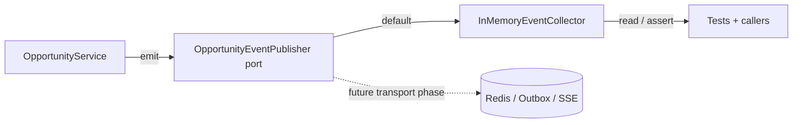

# Opportunity Domain Events (EDD Catalog)

## Purpose

Catalog for domain events emitted by the **Opportunities** bounded context. Events are immutable facts (dataclasses extending `shared.domain.domain_event.DomainEvent`) defined in `apps/backend/opportunities/domain/events.py`.

## EDD Approach (Incremental)

Per AGENTS.md rule 16: events are defined, emitted and documented; services emit through the context's event publisher port (`opportunities/domain/event_publisher.py`); the default implementation is an **in-memory collector** — no Redis, no SSE, no outbox. Emission is best-effort. A real transport is wired in a dedicated later phase.

### Event flow (current — in-memory)

## Event Catalog

### `opportunity.created`

- **Event**: `OpportunityCreated`
- **Trigger**: `OpportunityService.create_manual` persists a new opportunity.
- **Payload**: `opportunity_id`, `source`.
- **Fires when**: an inbound message is stored (`new`). Duplicate content returns the existing row and fires nothing.
- **Consumers**: none yet.

### `opportunity.extracted`

- **Event**: `OpportunityExtracted`
- **Trigger**: `OpportunityService.process` / `reprocess` stores the `opportunity.extract` result.
- **Payload**: `opportunity_id`, `has_role`, `has_company`, `url_count`.
- **Fires when**: the message moves `new` → `extracted`.
- **Consumers**: none yet.

### `opportunity.linked`

- **Event**: `OpportunityLinked`
- **Trigger**: resolution links an existing job/company, or `set_links` links/unlinks one manually.
- **Payload**: `opportunity_id`, `job_id`, `company_id`.
- **Fires when**: the opportunity moves to `enriching` with at least one link (or links change).
- **Consumers**: none yet.

### `opportunity.evaluated`

- **Event**: `OpportunityEvaluated`
- **Trigger**: `OpportunityService.process` / `reprocess` completes evaluation (scored or pending).
- **Payload**: `opportunity_id`, `status`, `overall_score`, `recommendation`.
- **Fires when**: an evaluation snapshot is appended (`evaluated`, `ready_to_apply`, or `needs_info`).
- **Consumers**: none yet.

### `opportunity.status.changed`

- **Event**: `OpportunityStatusChanged`
- **Trigger**: `OpportunityService.set_status`.
- **Payload**: `opportunity_id`, `status`.
- **Fires when**: the user moves the opportunity along the funnel.
- **Consumers**: none yet.

## Emission Rules

- Events are emitted by the service that performs the state change — never by callers (rule 16b).
- Emission is best-effort and never changes business behavior (rule 16c).
- Tests assert emitted events through the collector (rule 16d).

# Related Documents

- `docs/domain/opportunities/opportunity.md`
