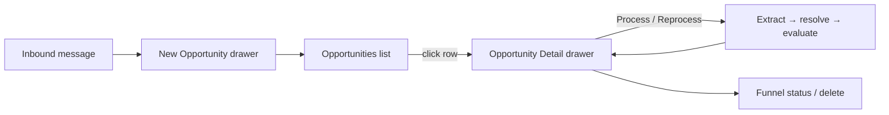

# Opportunities Page

## Purpose

The Opportunities page is the workspace for inbound recruiting messages: paste a message, watch it become a structured opportunity, and track it to an application. It complements — never replaces — the JD-first Jobs page.

Users can:

- Add a new inbound message (manual paste in phase one)
- Browse opportunities newest-first, search, filter by status/source
- Open an opportunity to see the original message, extracted info, links, evaluation, score, and next action
- Process/reprocess an opportunity when new information arrives
- Move an opportunity along the funnel; delete it

## Design Principles

- An opportunity may be incomplete — the UI shows `Evaluation pending` with missing information instead of invented scores.
- History is preserved: reprocessing appends evaluation snapshots; nothing is silently overwritten.
- No jobs, companies, or skills are created from this page — only links to existing ones.

## Desktop Layout

```text
┌──────────────────────────────────────────────────────────────────────────────┐
│ Opportunities                                                        ＋ New   │
├──────────────────────────────────────────────────────────────────────────────┤
│ Search ..........................................................            │
│ Status ▾              Source ▾                                  Refresh      │
├──────────────────────────────────────────────────────────────────────────────┤
│ # │ Opportunity              │ Source  │ Score │ Status         │ Updated     │
│──────────────────────────────────────────────────────────────────────────────│
│ 1 │ Senior Backend Engineer  │ Manual  │ 79    │ Ready to Apply │ 2m          │
│   │ Acme GmbH                                                        │        │
│ 2 │ Unknown role             │ Manual  │ —     │ Needs Info     │ 5m          │
│   │ Evaluation pending: job location and requirements are unknown    │        │
└──────────────────────────────────────────────────────────────────────────────┘
```



## Primary Sections

### Header

- Page title; `＋ New` opens the New Opportunity drawer.

### Toolbar

| Control  | Description                                              |
| -------- | -------------------------------------------------------- |
| Search   | Search by title, company, sender, or message text.       |
| Status   | Filter by lifecycle status.                              |
| Source   | Filter by source (`manual` / `gmail` / `linkedin`).      |
| Refresh  | Reload the current query.                                |
| Clear    | Clears all active filters.                               |

### Opportunity List

Rows show title (extracted role, else subject, else `Unknown role`), linked company, source, score (or `—` with a pending note), status badge, and updated time. Every row has a delete button. Default sort is newest first (`created_at desc`).

## States

- **Empty**: illustration + `No opportunities yet` + `Add your first inbound message`.
- **Loading**: skeleton rows.
- **Error**: banner with Retry.
- **Pending evaluation**: score cell shows `—` and the missing-information reason.
