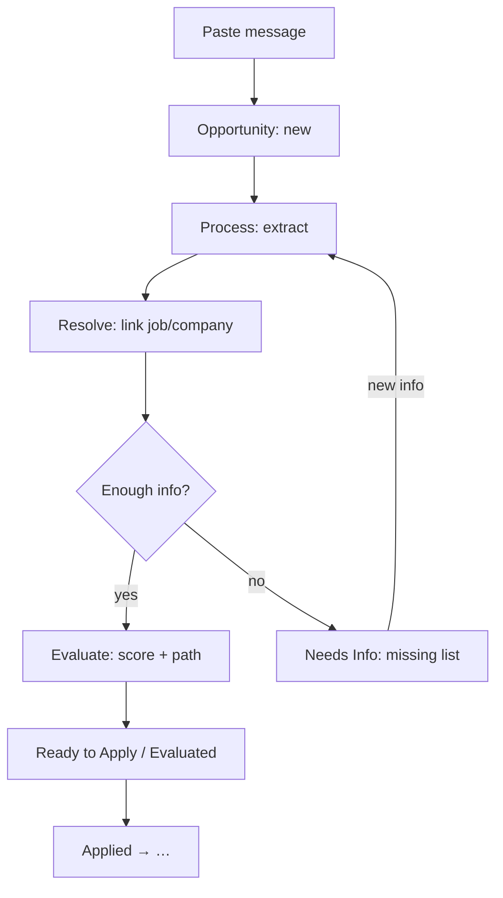

# Process an Inbound Opportunity

## Goal

Turn a pasted recruiter message into an evaluated, actionable opportunity.

## Steps

1. Open **Opportunities** → **＋ New**.
2. Paste the message; add sender, subject, received date when known.
3. Save → the opportunity appears as `new`.
4. Open it → **Process**: the system extracts fields, links any existing job/company, and evaluates against the candidate profile and rules.
5. Read the score + reasons, missing information, and next action.
6. Follow the application path (job URL, reply to sender, or research first).
7. Move the status along the funnel (`ready_to_apply` → `applied` → …).
8. When new information arrives (company identified, JD found), **Reprocess** — a new evaluation snapshot is appended to History.

## Edge cases

- Vague message → `needs_info` with an explicit missing list; no score shown.
- Duplicate paste → the existing opportunity is returned, not a new row.
- Job link matches an existing job → linked, never re-imported.
- AI failure → error banner with Retry; the stored message is never lost.
